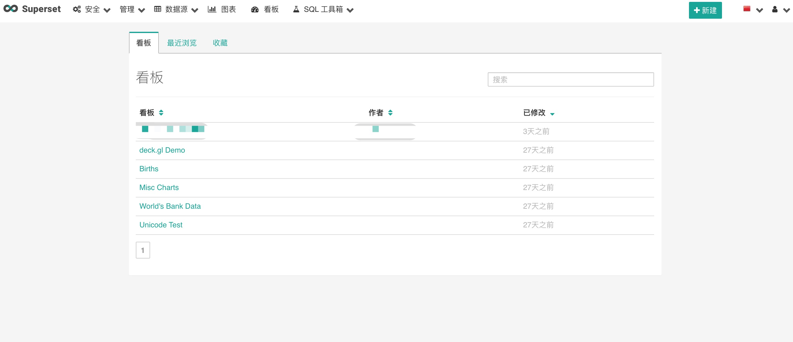
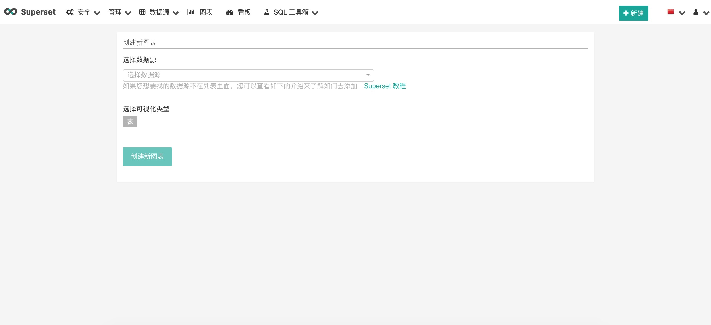
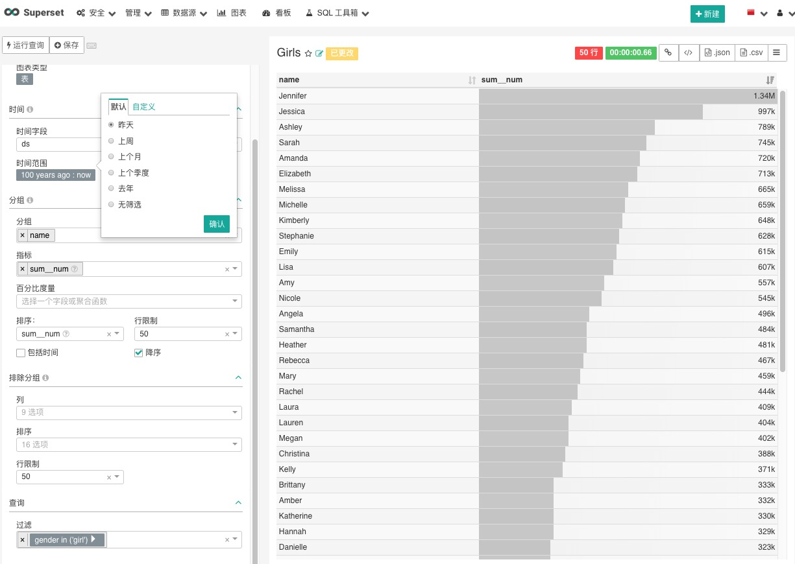

# 汉化 Apache-Superset 0.35版本

## 更新日志
1. 新增部分汉化信息，将部分组件支持文本翻译模式
2. 修复0.35版本一些问题（新增图表无法汉化等等）
3. 处理 moment.js 和 humanize 的汉化配置，可以根据用户选择的地区进行翻译。

## 汉化 `message.po` 文件的命令
```
po2json -d superset -f jed1.x superset/translations/zh/LC_MESSAGES/messages.po superset/translations/zh/LC_MESSAGES/messages.json
pybabel compile -d superset/translations
```

## 汉化截图
欢迎页



新增图表



遍及图表



后续会不定期更新汉化信息
